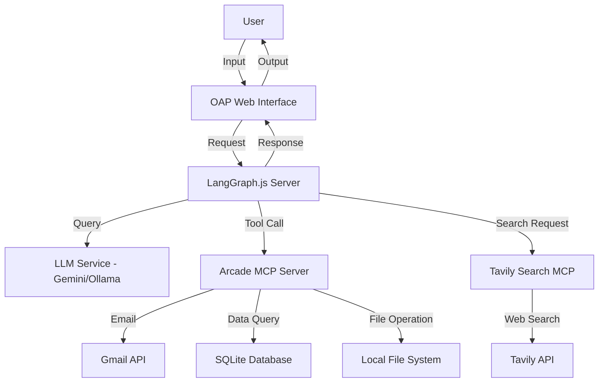

# Open Agent Platform: LangGraph JavaScript AI Agent

Welcome to the Open Agent Platform (OAP) JavaScript AI Agent project! This repository demonstrates how to set up, extend, and collaborate on an AI agent using LangGraph.js in a JavaScript-only environment on WSL, with a focus on clarity, best practices, and ease of contribution.

---

## Project Overview

- **Purpose:** Enable developers and AI assistants to build, test, and extend AI agents using only JavaScript (no Python required).
- **Key Features:**
  - Local and cloud deployment options
  - Secure email, database, and file operations via MCP servers (Arcade, Tavily Search)
  - Local model hosting with Ollama (JavaScript alternative to Hugging Face)
  - Clear project rhythm and contribution guidelines
  - Comprehensive documentation and testing

## Architecture



## Repository Structure

- `README.md` — Project overview, quick start, contribution guidelines, and key information for all users and AI assistants.
- `discussion_summary.md` — In-depth summary of the setup discussion, design decisions, code examples, and step-by-step instructions.
- `graph.js` (see code example in `discussion_summary.md`) — Main agent logic and integration with MCP tools.
- (Add your own files and features as needed!)

## Quick Start

1. **Clone the repository:**

   ```bash
   git clone https://github.com/your-username/open-agent-platform.git
   cd open-agent-platform
   ```

2. **Install dependencies:**

   ```bash
   npm install
   ```

3. **Set up environment variables:**

   - Create a `.env` file with your API keys (see `discussion_summary.md` for details).

4. **Start the agent locally:**

   ```bash
   npm run dev
   ```

5. **Set up MCP servers (Arcade, Tavily, etc.):**

   - See the "Setup Steps" section in `discussion_summary.md` for full instructions.

6. **Test the agent:**

   ```bash
   npm test
   ```

## Project Rhythm

This project follows a clear and collaborative development rhythm to ensure code quality, clarity, and smooth teamwork for both human and AI contributors:

1. **Start from Main (unless already on a feature branch):**

   If you are not already on a feature branch, switch to `main`:

   ```bash
   git checkout main
   ```

   Pull the latest changes to ensure your local repository is up to date:

   ```bash
   git pull origin main
   ```

   Ensure your working directory is clean (no uncommitted changes):

   ```bash
   git status
   ```

2. **Create a Feature Branch:**

   Create and switch to a new branch for your feature or fix:

   ```bash
   git checkout -b your-feature-name
   ```

3. **Develop in Isolation:**

   Make your changes, commits, and tests on the feature branch only.
   Write clear, descriptive commit messages for each logical change:

   ```bash
   git add .
   git commit -m "Describe your change clearly"
   ```

4. **Documentation:**

   Summarize major discussions, decisions, and design rationale in `discussion_summary.md` as needed.
   Update `README.md` if project-level instructions or structure change.

5. **Testing:**

   Ensure all code and workflows are tested before merging.

   ```bash
   npm test
   ```

6. **Review:**

   Review your changes for clarity, correctness, and completeness.
   Open a pull request for review and feedback.

7. **Merge:**

   After approval, merge your feature branch into `main`.
   Pull the latest changes to your local `main` after merging.

---

**Summary:**

- Always branch from an up-to-date `main` (unless already on a feature branch).
- Keep your work isolated, well-documented, and tested.
- Collaborate through clear commits, reviews, and pull requests.
- Use `discussion_summary.md` for technical context and `README.md` for high-level project info.

*This rhythm ensures a robust, maintainable, and welcoming project for both humans and AI assistants.*

## Collaboration & Contribution

- **AI assistants and human contributors are welcome!**
- Please read `discussion_summary.md` for full project context, setup, and design rationale.
- Follow the linting rules and quality standards in `.linting-rules.md`.
- Open issues or pull requests for improvements, bug fixes, or new features.
- Follow the project rhythm for smooth collaboration.

## Key Technologies

- **LangGraph.js** — Graph-based AI agent orchestration in JavaScript
- **Arcade MCP Server** — Secure email, database, and file tools
- **Tavily Search MCP** — Web search integration
- **Ollama** — Local LLM hosting (JavaScript alternative to Hugging Face)
- **Jest** — Testing framework

## Documentation

- All major setup steps, code examples, and design decisions are in `discussion_summary.md`.
- For a quick overview, see the "Project Rhythm" and "Setup Steps" sections.

---

**Ready to build, extend, or assist?**

- Start by reading `discussion_summary.md`.
- Set up your environment and MCP servers.
- Contribute your improvements, tools, or workflows!

*Let's make AI agent development accessible, robust, and collaborative — for both humans and AI assistants.*

---

## Troubleshooting

Here are solutions to common issues you might encounter:

### LangGraph Server Issues

- **Error: "Address already in use"**
  - Solution: Another process is using port 8123. Find and terminate it:
  
    ```bash
    lsof -i :8123
    kill -9 <PID>
    ```

- **Error: "Cannot find module '@langchain/langgraph'"**
  - Solution: Install missing dependencies:
  
    ```bash
    npm install @langchain/langgraph @langchain/google-genai
    ```

### MCP Server Issues

- **Arcade OAuth Authentication Fails**
  - Solution: Verify your Google Cloud Console credentials and ensure you've enabled the Gmail API.
  - Check redirection URI in your OAuth client configuration matches `http://localhost:8787/oauth2callback`.

- **Database Query Errors**
  - Solution: Ensure SQLite database exists and has the proper tables:
  
    ```bash
    cd ~/mcp-servers/arcade
    sqlite3 database.db ".tables"
    ```

### Ollama Issues

- **Model Download Fails**
  - Solution: Check disk space and internet connection:
  
    ```bash
    df -h
    ollama pull llama3 --insecure  # For SSL issues
    ```

- **Error: "Connection refused" when accessing Ollama API**
  - Solution: Ensure Ollama is running:
  
    ```bash
    ollama list
    ollama run llama3  # Start if not running
    ```

For more detailed troubleshooting steps, see the [discussion_summary.md](discussion_summary.md) file.

## Sample Output

Here are examples of what the agent can do:

### Basic Conversation

```text
User: Tell me a joke
Agent: Why don't scientists trust atoms? Because they make up everything!
```

### Email Tool Usage

```text
User: Send an email to the team about the project status
Agent: I'll send an email about the project status. What specific details should I include?
User: Mention we've completed the documentation and the agent is working well
Agent: Email sent to team@example.com with subject "Project Status Update". 
The email mentioned the completion of documentation and the successful agent implementation.
```

### Database Query 

```text
User: How many users do we have in the database?
Agent: I've queried the database. We currently have 42 users registered in the system.
```

### File Operations

```text
User: Create a report on our progress
Agent: I've created a report file "progress_report.txt" with a summary of our recent achievements
and current project status.
```
